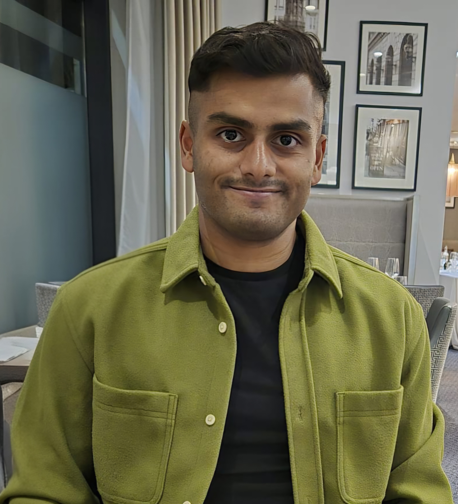

# Danyaal Kaleel
{: style="text-align: center;"}

#### Email: danyaal.kaleel@outlook.com 
{: style="text-align: center;"}

## PROFESSIONAL SUMMARY
{: style="text-align: center;"}

Danyaal Kaleel is a post doctoral researcher at Ensta Brest. His current research looks into developing a state of the art simulation tool for collision avoidance at sea. 

He obtained his PhD from the Centre for Advanced Robotics at Queen Mary University of London. His PhD research involved developing buoyancy actuation for soft robots using incompressible fluids. This involved designing and building functional prototypes of buoyancy actuated soft robot arms and performing laboratory  based testing of these prototypes in underwater tanks. This also involved mathematically demonstrating the incompressibility of the fluids being examined and performing experiments to characterise the forces produced by these fluids. 

 Google Scholar: <a href="https://scholar.google.co.uk/citations?user=dkbcR5sAAAAJ&hl=en"> Danyaal Kaleel </a>

## EDUCATION 
{: style="text-align: center;"}
### PhD, Queen Mary University of London, Mechanical Eng. Sep 2021 – Jul. 2026 

- Thesis Titled: Buoyancy Actuation Using Incompressible Fluids in Soft Robots for Deep Sea Operations 

- PhD Project: Designed, manufactured and experimentally validated buoyancy actuated soft robot arms for underwater operations. 

- Skills: Public speaking, programming (Python, MATLAB, Arduino), manufacturing soft robots (ultrasonic welding, vacuum impulse welding, 3D printing), designing and executing experimental test plans. 

### BEng, Queen Mary University of London, Robotics Eng. Sep. 2018 – Jul. 2021 

- Degree Classification: BEng First Class Honours 

- Final Year Project: Developed an algorithm to navigate a wheeled mobile robot around a hospital wardroom for autonomous cleaning and disinfection. Algorithm was built in C++ and used ROS for controlling the robot. The algorithm was tested in the Gazebo robot simulator. 

- Skills: Programming (Java, C, MATLAB, 8051 assembly language, ROS), Solidworks, Abaqus, Star CCM+. 

## WORK HISTORY 
{: style="text-align: center;"}
### Module Demonstrator - School of Engineering and Materials Science and School of Electronic Engineering and Computer Science Sep. 2022 – Dec. 2024 

- Organised workshops to enhance student’s practical skills and understanding. 

- Collaborated with academic staff to improve course delivery and content relevancy. 

- Guided students through hands-on activities, fostering their problem-solving skills and creativity. 

- Delivered lectures on robot maths to groups of 30 students. 

- Provided technical support during laboratory sessions, mitigating potential disruptions in the learning process. 

- Verbally explained complex concepts with complementing visual aids, enhancing clarity and retention rates among learners. 

- Ensured safety whilst conducting demonstrations with adherence to strict safety protocols. 

### Engineering Ambassador - Proud to be an Engineer (Royal Academy of Engineering) Nov. 2023 – Jul. 2024 

- Designed and delivered public engagement events to raise awareness of engineers from non-traditional backgrounds. 

- Secured generous funding from Royal Academy of Engineering for the initiative. 

### Research Assistant - Queen Mary University of London Jan. 2022 – Mar. 2022  

- Collaborated with a team of engineers to design and build an eversion robot system capable of surveying the internal structure of buildings and applying insulating     material. 

## SCHOLARSHIPS AND AWARDS 
{: style="text-align: center;"}
**Award: Associate Fellowship of the Higher Education Academy (AFHEA)** Nov. 2025 Issued by: Advance HE 

**Scholarship: PhD Studentship** Sep. 2021 Issued by: Queen Mary University of London 

**Award: School of Engineering and Materials Science School Prize for Robotics for the Best Robotics Engineering Graduate** Jul. 2021  Issued by: Queen Mary University of London 

**Award: Fred and Rose Zappert Prize for Outstanding Academic Achievement in the 2020/21 Academic Year** Jul. 2021 Issued by: Queen Mary University of London 

## PUBLICATIONS 
{: style="text-align: center;"}
1. **D. Kaleel**, T. Lalitharatne, A. Baker, H. Wurdemann, B. Clement and K. Althoefer, “Buoyancy Actuation of an Underwater Soft Robot Arm through Inflation with Incompressible Fluids,“ Ocean Engineering (Under Review) 

2. **D. Kaleel**, B. Clement, and K. Althoefer, “Modelling of Buoyancy Based Actuation of an Inflatable Underwater Soft Robot,” TAROS (Towards Autonomous Robotic Systems), 2024. 

3. **D. Kaleel**, B. Clement, and K. Althoefer, “Hydraulic Volumetric Soft Everting Vine Robot Steering Mechanism for Underwater Exploration, “ IFAC-PapersOnLine, 2024. 

4. C. Suulker, S. Skach, **D. Kaleel** , T. Abrar, Z. Murtaza, D. Suulker, and K. Althoefer, "Soft Cap for Vine Robots," 2023 IEEE/RSJ International Conference on Intelligent Robots and Systems (IROS), Detroit, MI, USA, 2023. 

5. **D. Kaleel**, B. Clement and K. Althoefer, "A Framework to Design and Build a Height Controllable Eversion Robot," 2023 11th International Conference on Control, Mechatronics and Automation (ICCMA), Grimstad, Norway, 2023. 

## SKILLS AND INTERESTS 
{: style="text-align: center;"}
- IT: Proficient in using Office365 suite, Python, C, MATLAB, Arduino. 
- Music: Achieved Grade 8 Distinction in Classical guitar. 
- Sport: Regular training at gym, five times a week. 
- Travel: Extensively travelled around Europe, Asia, Australia and America. 

